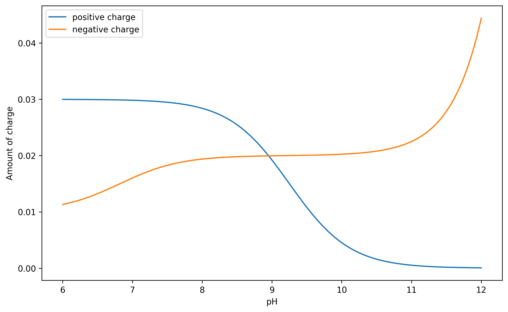
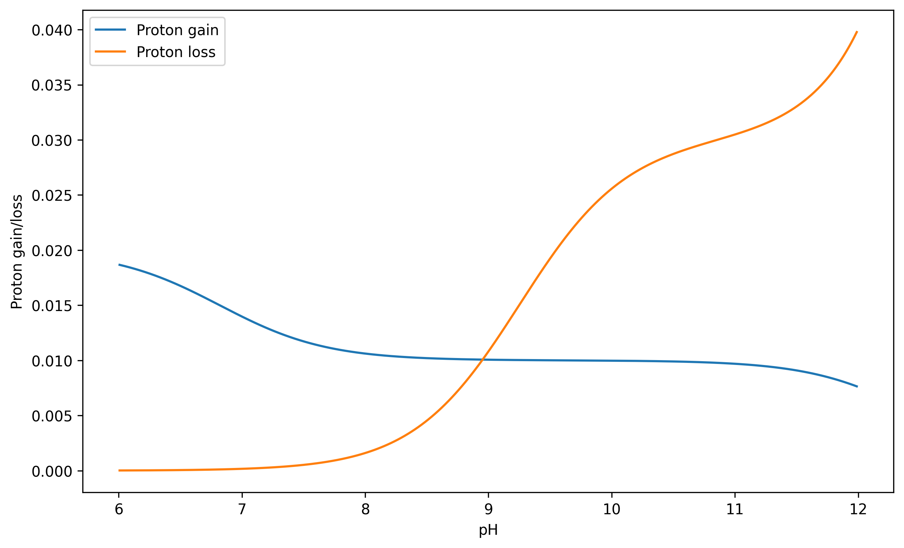
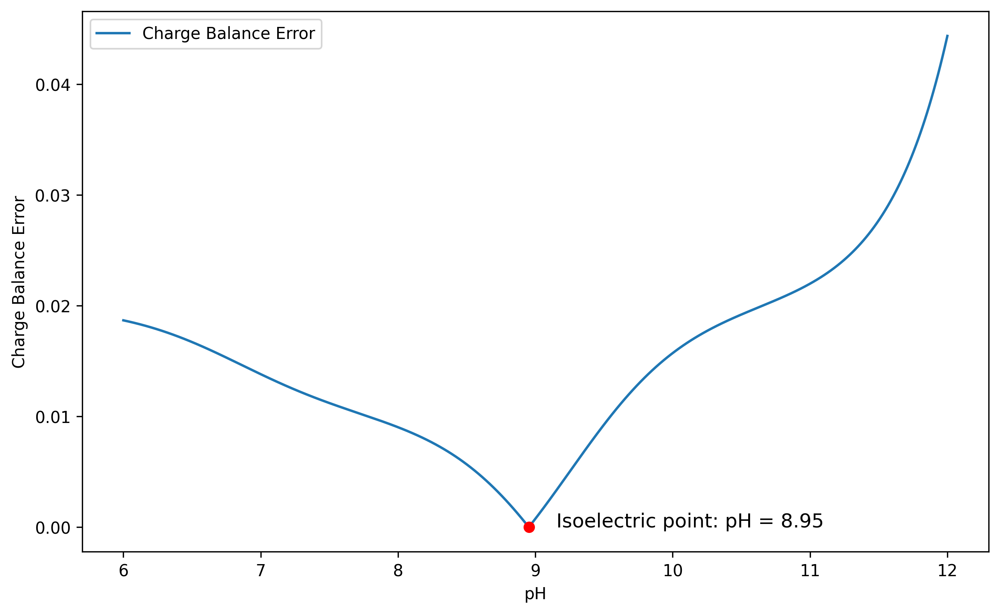

# 🧪 pH Calculation 🤖 <!-- omit in toc -->
### Comprehensive Analysis of Acid-Base Equilibria Using MBE, CBE, and PBE <!-- omit in toc -->

[](https://www.python.org/downloads/release/python-380/)
[](https://jupyter.org/)
[](https://www.scipy.org/)


This repository contains the code and data used in the paper "Comprehensive Analysis of Acid-Base Equilibria Using MBE, CBE, and PBE". The code is written in Python and can be run in any Python environment with the required libraries installed. Jupyter notebooks are also provided for interactive exploration of the calculations and results.

The paper is available in the `documents` folder, and the compiled pKa data used in the calculations is available in the `pKa_data` folder.

📄 Want to read the paper? [**Click here**](https://phcal.ericxin.eu/doc/doc.pdf)

🌐 Prefer the online version? [**Click here**](https://phcal.ericxin.eu)

## Table of contents

- [Table of contents](#table-of-contents)
- [Introduction](#introduction)
- [Theory](#theory)
  - [Acid-Base Reactions and Equilibria in Solution](#acid-base-reactions-and-equilibria-in-solution)
  - [Equilibrium Constants](#equilibrium-constants)
  - [Material Balance Equation (MBE)](#material-balance-equation-mbe)
  - [Charge Balance Equation (CBE)](#charge-balance-equation-cbe)
  - [Proton Balance Equation (PBE)](#proton-balance-equation-pbe)
  - [Calculate the pH](#calculate-the-ph)
- [Installation](#installation)
- [Running the Code](#running-the-code)
- [Code Structure](#code-structure)
- [Examples](#examples)
  - [Example 1: Calculation of 0.01 M HCl](#example-1-calculation-of-001-m-hcl)
  - [Example 2: Calculation of 0.01 M (NH4)2(HPO4)](#example-2-calculation-of-001-m-nh42hpo4)
- [Contact](#contact)
- [License](#license)

## Introduction

This project explores the calculation of acid-base equilibrium calculations, focusing on the Material Balance Equation (MBE), Charge Balance Equation (CBE), and Proton Balance Equation (PBE). The code provided in this repository allows for the calculation of pH values for various acid-base systems using the CBE and PBE methods. 

## Theory

### Acid-Base Reactions and Equilibria in Solution

Acid-base reactions in solution are governed by the activity of ions, which refers to their effective concentration in chemical reactions. Due to electrostatic interactions between ions, their effective concentration (activity) can differ from their actual concentration. The relationship between the activity $a_i$ and the concentration $c_i$ of an ion $i$ is given by:

$$
a_i = \gamma_i \, c_i 
$$

where $\gamma_i$ is the activity coefficient. For dilute solutions, the Debye-Hückel equation can be used to approximate the activity coefficient:

$$
-\log \gamma_i = \frac{0.51 z_i^2 \sqrt{I}}{1 + B a_i \sqrt{I}}
$$

where $z_i$ is the charge of ion $i$, $B$ is a constant, $a_i$ is the ion volume parameter, and $I$ is the ionic strength of the solution.

### Equilibrium Constants

The equilibrium constant $K$ for a reaction can be expressed in terms of activities (thermodynamic constant $K^\circ$) or concentrations (concentration constant $K$):

$$
K^\circ = \frac{a_{\text{A}^-} a_{\text{HB}^+}}{a_{\text{B}} a_{\text{HA}}}
$$
$$
K = \frac{[\text{A}^-][\text{HB}^+]}{[\text{B}][\text{HA}]}
$$

The relationship between $K^\circ$ and $K$ involves the activity coefficients:

$$
K^\circ = K \cdot \frac{\gamma_{\text{A}^-} \gamma_{\text{HB}^+}}{\gamma_{\text{B}} \gamma_{\text{HA}}}
$$

### Material Balance Equation (MBE)

The Material Balance Equation (MBE) states that the total concentration of a substance in a chemical equilibrium system is equal to the sum of the equilibrium concentrations of all relevant species. For example, for a solution with concentration $c$ of $\text{H}_3\text{PO}_4$:

$$
[\text{H}_3\text{PO}_4] + [\text{H}_2\text{PO}_4^-] + [\text{HPO}_4^{2-}] + [\text{PO}_4^{3-}] = c
$$

### Charge Balance Equation (CBE)

The Charge Balance Equation (CBE) ensures that the total positive charge in a solution equals the total negative charge. (As the solution is always neutral in charge) For example, in a solution with concentration $c$ of $\text{NaCN}$:

$$
[\text{H}^+] + [\text{Na}^+] = [\text{OH}^-] + [\text{CN}^-]
$$

Below is a diagram of the CBE curve for a solution of $\text{(NH4)}_3\text{(PO4)}$:



### Proton Balance Equation (PBE)

The Proton Balance Equation (PBE) states that the amount of protons gained by substances (bases) equals the amount of protons lost by substances (acids). For example, in an aqueous solution of $(\text{NH}_4)\text{HPO}_4$:

$$
[\text{H}^+] + [\text{H}_2\text{PO}_4^-] + 2[\text{H}_3\text{PO}_4] = [\text{OH}^-] + [\text{PO}_4^{3-}] + [\text{NH}_3]
$$

These equations are essential tools for understanding and predicting the behavior of acid-base systems in solution.

Here is an example of the PBE curve for a solution of $\text{(NH4)}_3\text{(PO4)}$:



### Calculate the pH

Not that we have the equations, we can calculate the pH of a solution using the CBE or PBE method. The general steps are as follows:
1. Define the acid and base species in the solution, including their charges, concentrations, and pKa values.
2. Calculate the equilibrium concentrations of all species using the MBE.
3. Use the CBE or PBE to calculate the Error function, which is a measure of the deviation from charge balance or proton balance.
4. Use an optimization algorithm to minimize the Error function and find the pH of the solution.
5. Output the pH value and other relevant information about the acid-base system.

Below is a diagram of the absolute error of CBE for a solution of $\text{(NH4)}_3\text{(PO4)}$:



We can easily find the point where CBE_error = 0 by using the minimization algorithm or gradient descent. The pH value at this point is the pH of the solution.

> For more details, please refer to the paper at [documents/doc.pdf](documents/doc.pdf) or the online version at [phcal.ericxin.eu](https://phcal.ericxin.eu).

## Installation

1. Clone the repository:
    ```sh
    git clone https://github.com/Eric-xin/pH_Calculation.git
    cd pH_Calculation
    ```

2. Create a virtual environment and activate it:
    ```sh
    python -m venv venv
    source venv/bin/activate  # On Windows use `venv\Scripts\activate`
    ```

3. Install the required libraries:
    ```sh
    pip install -r requirements.txt
    ```

## Running the Code

To run the code, you can use the provided Jupyter notebooks or run the Python scripts directly. For example, to run the `CBE.ipynb` notebook:

1. Start Jupyter Notebook:
    ```sh
    jupyter notebook
    ```

2. Open `CBE.ipynb` in the Jupyter interface and run the cells.

## Code Structure

The code is organized as follows:

```
.
├── CBE.ipynb # Jupyter notebook for Charge Balance Equation (CBE) based calculations
├── LICENSE # MIT License
├── PBE_investigation.ipynb # Jupyter notebook for Proton Balance Equation (PBE) based calculations (investigation)
├── assets
│   └── img # Image files used in the readme
├── calculation # Code for MBE, CBE, and PBE calculations
│   ├── Basics.py # Basic classes and functions for acid-base calculations, based on MBE
│   ├── CBE_calc.py
│   ├── PBE_calc.py
├── documents
│   ├── doc.pdf # Paper "Comprehensive Analysis of Acid-Base Equilibria Using MBE, CBE, and PBE"
├── pKa_data # Compiled pKa data for various acids, used in the calculations
│   ├── pka-compilation-williams.pdf
│   └── readme.md
└── readme.md # This file
```

## Examples

### Example 1: Calculation of 0.01 M HCl

**Charge Balance Equation (CBE) Calculation**

```python
from calculation import *

HCl = CBE_Inert(charge=-1, conc=0.01)
pH = CBE_calc(HCl)
pH.pH_calc()

print(pH.pH) # the result should be 1.9999977111816385
```

**Proton Balance Equation (PBE) Calculation**

```python
from calculation import PBE_Inert
HCl = PBE_Inert(conc=0.01, proton=1, proton_ref=1)
# HCl = PBE_Acid(conc=0.01, Ka=100000, proton=1, proton_ref=1)
calc = PBE_calc(HCl)
calc.pH_calc()
print(calc.pH)
```

### Example 2: Calculation of 0.01 M (NH4)2(HPO4)

**Charge Balance Equation (CBE) Calculation**
```python
NH4 = Acid(charge=1, conc=0.01*3, pKa=9.25)
pKa = [1.97, 6.82, 12.5]
P = Acid(charge=0, conc=0.01, pKa=pKa)

pH = CBE_calc(NH4, P)
pH.pH_calc()

print(pH.pH) # the result should be 8.952952575683597
```

**Proton Balance Equation (PBE) Calculation**
```python
from calculation import PBE_Acid, PBE_calc

NH4 = PBE_Acid(conc=0.01 * 3, pKa=9.25, proton=1, proton_ref=1)
pKa = [1.97, 6.82, 12.5]
P = PBE_Acid(conc=0.01, pKa=pKa, proton=3, proton_ref=0)
calc = PBE_calc(NH4, P)
calc.pH_calc()

print(calc.pH)
```

> For more examples, see the Jupyter notebooks. 'CBE.ipynb' for CBE calculations and 'PBE.ipynb' for PBE calculations.

## Contact

If you have any questions or suggestions, please feel free to contact me at [me@ericxin.eu](mailto:me@ericxin.eu).

## License

This project is licensed under the MIT License. See the [LICENSE](LICENSE) file for details.